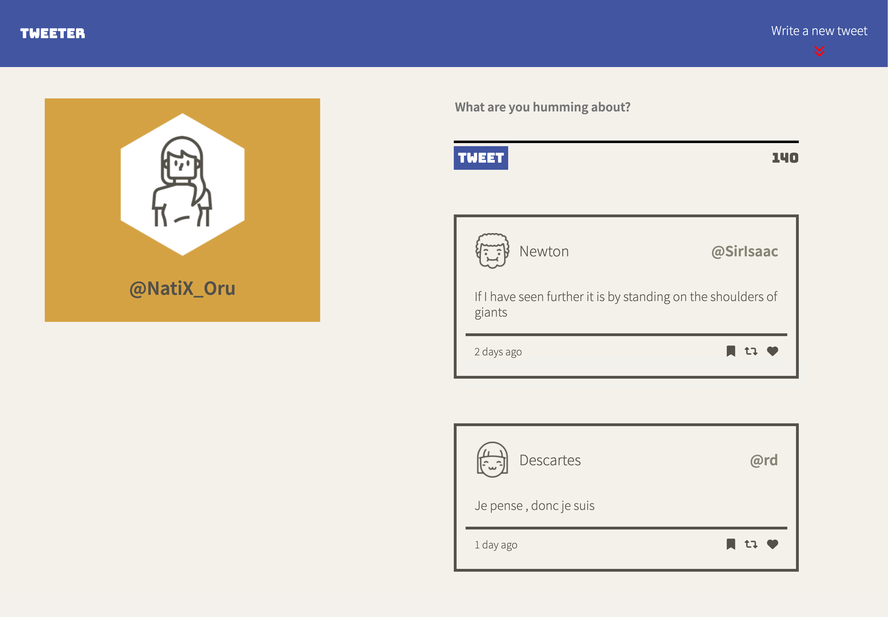
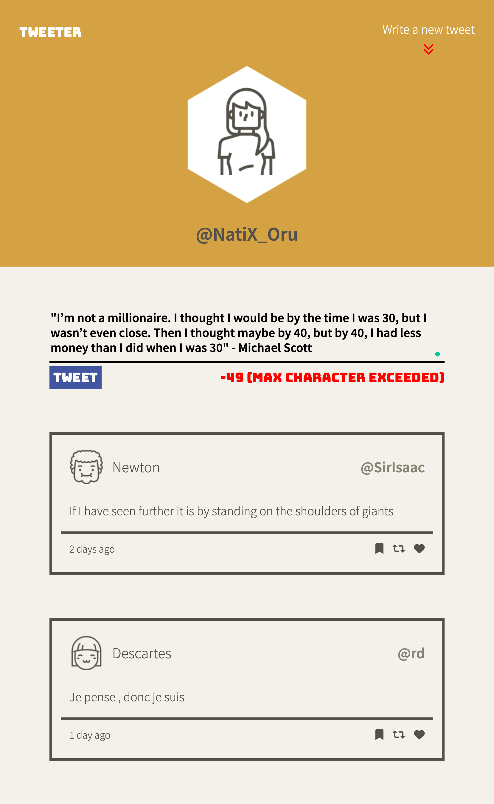

# Tweeter Project

Tweeter is a simple, single-page Twitter clone. Built with HTML, CSS, JS, jQuery, and AJAX.
## Final Product

 Displays validation errors within app

## Dependencies
- Body Parser
- Chance
- Express
- Node 5.10.x or above
- md5
## Getting Started
1. Install dependencies using the `npm install` command.
2. Start the web server using the `npm run local` command. The app will be served at <http://localhost:8080/>.
3. Go to <http://localhost:8080/> in your browser.